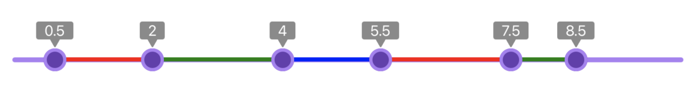

# React Native Polyslider

This slider is probably having the smallest code size among others because it only provides base class of 45 lines of typescript that allows to build your own version of the slider that includes only what is neccessary in your project. To check it in action clone this repository. You need `expo` being installed on your machine. Install all dependencies with `yarn` or `npm install` then run `yarn start` or `expo start` from the root folder.

## Getting Started

```
$ yarn add @tandu/polyslider
```

or

```
$ npm i @tandu/polyslider
```

## Usage

`Polyslider` supposes that slider can have one track and several markers. It is a base class to build the slider.

There are 2 slider examples:
- slider: in `demo/components/Slider` is simple slider with just track and marker. Allows to define `step`.
<p align="center"></img></p>

- multislider: in `demo/components/Multislider` supports multiple marks, step offset and highlights ranges on a track.
<p align="center"></img></p>

You can reference those sliders while writing your version or just copy+paste `Multislider` / `Slider` folder into your application and edit inplace.

---

# Reference

## Props

### `range`

Defines slider range. For example `[0, 10]`.

| Type       | Required |
| ---------- | -------- |
| `Array`    | Yes      |

---

### `containerStyle`

Style for the topmost view that contains slider elements. You can use it to setup margins or define slider width/height.

| Type                   | Required |
| ---------------------- | -------- |
| `StyleProp<ViewStyle>` | Yes      |

---

### `markersContainerStyle`

The main purpose of this property is to properly setup horizontal margins so that marker touches right edge of the track with its right edge. So you probably don't need to put anything other than `marginHorizontal: <value>` into here.

| Type                   | Required |
| ---------------------- | -------- |
| `StyleProp<ViewStyle>` | Yes      |

---

### `track`

It provides `width` to the function that should return track jsx component. `width` is useful to calculate ranges in case of multislider otherwise it can be ignored.
```jsx
track = (width) =>
    <View style={{
      position: 'absolute',
      height: 6,
      top: 13,
      borderRadius: 5,
      width: '100%',
      backgroundColor: '#ac7ef4'
    }}/>
```

| Type                              | Required |
| --------------------------------- | -------- |
| `(width: number) => ReactElement` | Yes      |

---

### `marker`

It provides `val` to the function that should return marker jsx component. `val` to show current value in a label belonging to the marker as it is done in multislider example otherwise it can be ignored.
```jsx
marker = (val) =>
      <View style={{
        borderRadius: 15,
        borderWidth: 4,
        width: 28,
        height: 28,
        marginLeft: -14
      }}/>
    </View>
```

| Type                                           | Required |
| ---------------------------------------------- | -------- |
| `(val: number, index: number) => ReactElement` | Yes      |

---

### `values`

Defines Array of values. For each value the marker is created. Should contain at least one element in an array.

| Type          | Required |
| ------------- | -------- |
| `number[]`    | Yes      |

---

### `onChange`

Is called on every marker move. `val` is new value and `index` matches the index in `values` array.
```jsx
onChange = {(val, i) => {
  const newValues = [...values];
  newValues[i] = val;
  setValues(newValues);
}}
```

| Type                                   | Required |
| -------------------------------------- | -------- |
| `(val: number, index: number) => void` | Yes      |

---

### `onChangeFinished`

Is called on marker move end when pan gesture is finished. `val` is new value and `index` matches the index in `values` array.
```jsx
onChangeFinished = {(val, i) => {
  const newValues = [...values];
  newValues[i] = val;
  setValues(newValues);
}}
```

| Type                                   | Required |
| -------------------------------------- | -------- |
| `(val: number, index: number) => void` | Yes      |

---
